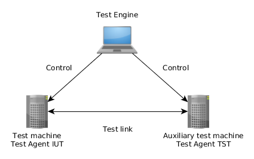

.. SPDX-License-Identifier: Apache-2.0
.. toctree::
   :hidden:

   generated/rst/group_ibvapi_tests.rst
   generated/rst/group_arg_types.rst
   dox_resources/terminology.rst
   dox_resources/refs.rst
   dox_resources/internal.rst

Infiniband Verbs API Test Suite Documentation
=============================================

.. contents:: Table of Contents

----------------
Copyright Notice
----------------

Copyright (c) 2012-2022 OKTET Labs Ltd.

------------
Introduction
------------

Infiniband Verbs API Test Suite is aimed to check certain implementation
of an Infiniband Verbs API and underlying HW. It uses TE as its engine.

See :ref:`Abbreviations<term_abbrev>`

----------
References
----------

Find list of documentation mentioned on the
:ref:`References page<refs_details>`

-----------
Conventions
-----------

Parameters of tests are referred in the text using bold italic (for example,
**iut_rpcs**).

Standard defines, elements of enumerations as well as **errno** values
appear in monotype font (for example, `AF_INET`, `ENOMEM`).

-------
Testbed
-------

The following setup is required to run the test suite. In theory, Test Engine
may run on either Test machine or Auxiliary test machine.

---------------
Test parameters
---------------

The test suite uses extensive parametrization. Details of the XML syntax and
how to read the XML that describes the parameters can be found in
`TE Tester <https://www.oktetlabs.ru/~tester/te-doc-sphinx/generated/group_te_engine_tester.html>`_
documentation.

****************************
Parameter naming conventions
****************************

.. list-table::
  :header-rows: 1

  *
    - Name
    - Description
  *
    - iut_rpcs
    - RPC server on IUT
  *
    - iut_if
    - Network interface on the IUT
  *
    - iut_mac
    - MAC address of the **iut_if**
  *
    - iut_addr
    - IPv4/6 unicast address allocated for IUT interface
  *
    - tst_rpcs
    - RPC server on TST
  *
    - tst_if
    - Network interface on TST connected to the **iut_if**
  *
    - tst_mac
    - MAC address of the **tst_if**
  *
    - tst_addr
    - IPv4/6 unicast address assigned to the **tst_if**
  *
    - other_mac
    - Other unicast MAC address

--------------------
Test Suite Structure
--------------------

* :ref:`Tests <doxid-group__net__drv__tests>`

********
TRC Tags
********

List of TRC tags can be found on the
:ref:`corresponding page<tags_details>`.

********************
Tester Requirements
********************

List of Tester requirements can be found on the
:ref:`corresponding page<reqs_details>`.
